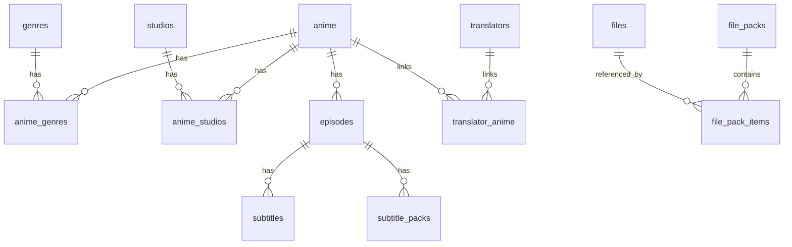

# Database schema (app contract)

This document reflects **what the codebase expects** from Supabase. RLS policies and SQL migrations are not stored in this repo; configure them in the Supabase dashboard.

> **Note:** `docs/database-simple-schema.md` is outdated (single-table design). Use this file instead.

## Overview

External: **AniList** IDs on `anime.anilist_id` for schedule → local catalog mapping.

---

## Core catalog

### `anime`

Main catalog row. Image column name is configurable via `VITE_ANIME_IMAGE_COLUMN` (default `cover_image`).

| Column (used in code) | Notes |
|----------------------|--------|
| `id` | Primary key |
| `title` | Display title |
| `cover_image` / env override | Poster URL |
| `featured_image` | Hero / slider image |
| `synopsis` | Description |
| `format` | e.g. TV, MOVIE |
| `airing_status` | Release status |
| `average_score` | Optional score |
| `episodes_count` | Planned/total episodes |
| `studio` | Legacy text field (also normalized via `anime_studios`) |
| `season`, `year` | Broadcast metadata |
| `start_date`, `end_date` | ISO dates |
| `is_featured` | Home slider flag |
| `anilist_id` | Bridge for Schedule page |
| `created_at` | Sorting |

Admin edit may also use: `has_special_season`, `special_season_insert_after`, etc. (see `AdminAnimeEdit.tsx` / `getAnimeAdminById`).

### `genres`

| Column | Notes |
|--------|--------|
| `id`, `slug` | Unique slug |
| `name_en`, `name_fa` | Display names |

### `anime_genres`

Join: `anime_id`, `genre_id` (or slug-based upsert in admin).

### `studios`

| Column | Notes |
|--------|--------|
| `id`, `slug`, `name` | Studio identity |

### `anime_studios`

Join: `anime_id`, `studio_id`.

---

## Episodes & subtitles

### `episodes`

| Column | Notes |
|--------|--------|
| `id`, `anime_id` | |
| `episode_number`, `season_number` | |
| `title` | Episode title |
| `air_date` | Optional |

### `subtitles`

Per-episode subtitle tracks.

### `subtitle_packs`

Grouped subtitle offerings linked to episodes (admin).

---

## Translators

### `translators`

| Column | Notes |
|--------|--------|
| `id`, `slug`, `name` | |
| `avatar_url`, `cover_url` | Optional |
| `bio`, `experience` | Optional text |

### `translator_anime`

Links translator ↔ anime.

---

## Files & Telegram bot packs

### `files`

Downloadable assets tracked by the bot.

| Column | Notes |
|--------|--------|
| `key` | Primary identifier |
| `file_name`, `caption` | Display / search |
| `file_size` | Bytes |
| `downloads` | Counter |
| `last_accessed`, `created_at` | Stats |
| `is_active` | Soft enable/disable |

Used by: `supabaseFiles.ts`, admin file picker in `AdminFilePacks`.

### `file_packs`

| Column | Notes |
|--------|--------|
| `id`, `slug`, `title` | |
| `description`, `is_active` | |
| `created_at` | |

Deep link: `https://t.me/{bot}?start=pack_{slug}`

### `file_pack_items`

| Column | Notes |
|--------|--------|
| `pack_id`, `file_key` | Composite identity |
| `sort_order` | Order in pack |

---

## Code map

| Service file | Tables |
|--------------|--------|
| `src/services/supabaseAnime.ts` | anime, genres, studios, episodes, subtitles, translators, joins |
| `src/services/supabaseFiles.ts` | files |
| `src/services/supabasePacks.ts` | file_packs, file_pack_items |

## RLS & admin

The mini app uses **`VITE_SUPABASE_ANON_KEY`** in the browser. Admin routes are gated by `AdminGate` (Telegram ID allowlist or web password), but **data access still depends on Supabase RLS**.

- **[docs/rls.md](./rls.md)** — policy templates and manual test checklist
- **[docs/admin-auth.md](./admin-auth.md)** — admin gate behavior and production checklist
