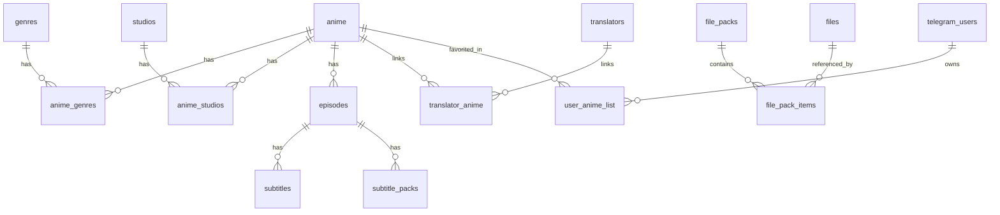

# Database schema (app contract)

> **Architecture (2026):** The mini-app and admin talk to **Shiori API** (`VITE_SHIORI_API_URL`). Postgres schema below is the source of truth. For self-hosted SQL migrations use `api.shiori.cloud/scripts/sql/production_schema_catchup.sql`.

This document reflects **what the codebase expects** from the Postgres catalog. Apply schema changes via API repo SQL scripts or your migration tool.

> **Note:** `docs/database-simple-schema.md` is outdated (single-table design). Use this file instead.

## Overview

External: **AniList** IDs on `anime.anilist_id` for schedule → local catalog mapping.

---

## Core catalog

### `anime`

Main catalog row. Image column name is configurable via `VITE_ANIME_IMAGE_COLUMN` (default `cover_image`).

| Column (used in code) | Notes |
|----------------------|--------|
| `id` | Primary key |
| `slug` | Unique URL segment + media file prefix (`{slug}-thumb`, `{slug}-cover`) |
| `title` | Display title |
| `cover_image` / env override | Poster URL |
| `featured_image` | Hero / slider image |
| `synopsis` | Description |
| `format` | e.g. TV, MOVIE |
| `airing_status` | Release status |
| `average_score` | Optional score |
| `episodes_count` | Planned/total episodes |
| `studio` | Legacy text field (also normalized via `anime_studios`) |
| `season`, `year` | Broadcast metadata |
| `start_date`, `end_date` | ISO dates |
| `is_featured` | Home slider flag |
| `episode_pack_title`, `episode_pack_link` | Optional all-episodes download pack (admin) |
| `anilist_id` | Bridge for Schedule page |
| `created_at` | Sorting |

Admin edit may also use: `has_special_season`, `special_season_insert_after`, etc. (see `AdminAnimeEdit.tsx` / `getAnimeAdminById`).

### `genres`

| Column | Notes |
|--------|--------|
| `id`, `slug` | Unique slug |
| `name_en`, `name_fa` | Display names |

### `anime_genres`

Join: `anime_id`, `genre_id` (or slug-based upsert in admin).

### `studios`

| Column | Notes |
|--------|--------|
| `id`, `slug`, `name` | Studio identity |

### `anime_studios`

Join: `anime_id`, `studio_id`.

---

## Episodes & subtitles

### `episodes`

| Column | Notes |
|--------|--------|
| `id`, `anime_id` | |
| `episode_number`, `season_number` | |
| `title` | Episode title |
| `air_date` | Optional |

### `subtitles`

Per-episode subtitle tracks.

### `subtitle_packs`

Grouped subtitle offerings linked to episodes (admin).

---

## Translators

### `translators`

| Column | Notes |
|--------|--------|
| `id`, `slug`, `name` | |
| `avatar_url`, `cover_url` | Optional |
| `bio`, `experience` | Optional text |

### `translator_anime`

Links translator ↔ anime.

---

## Files & Telegram bot packs

### `files`

Downloadable assets tracked by the bot.

| Column | Notes |
|--------|--------|
| `key` | Primary identifier |
| `file_name`, `caption` | Display / search |
| `file_size` | Bytes |
| `downloads` | Counter |
| `last_accessed`, `created_at` | Stats |
| `is_active` | Soft enable/disable |

Used by: admin file picker in `AdminFilePacks` (dash API).

### `file_packs`

| Column | Notes |
|--------|--------|
| `id`, `slug`, `title` | |
| `description`, `is_active` | |
| `created_at` | |

Deep link: `https://t.me/{bot}?start=pack_{slug}`

### `file_pack_items`

| Column | Notes |
|--------|--------|
| `pack_id`, `file_key` | Composite identity |
| `sort_order` | Order in pack |

---

## Users & personal lists

### `telegram_users`

Telegram Mini App users (registered on each app open via RPC `register_telegram_user_visit`).

| Column | Notes |
|--------|--------|
| `telegram_user_id` | Primary key (Telegram user id) |
| `first_name`, `last_name` | Profile from WebApp |
| `username` | Without `@`; preserved on revisit if Telegram omits it |
| `language_code`, `photo_url`, `is_premium` | From WebApp |
| `app_role` | `user` \| `moderator` \| `admin` — admin grants panel access via DB |
| `admin_notes` | Internal admin notes |
| `first_seen_at`, `last_seen_at`, `visit_count` | Activity |

View: `telegram_users_admin` (includes `favorites_count` from join).

SQL: `sql/bootstrap/telegram-users.sql`, `telegram-users-roles.sql`, `telegram-users-fix-username.sql`

### `user_anime_list`

Per-user favorites, watch progress, and rating.

| Column | Notes |
|--------|--------|
| `telegram_user_id`, `anime_id` | Unique pair (`anime_id` is UUID) |
| `episodes_watched` | Progress |
| `user_rating` | 1–10 or NULL |
| `updated_at` | Sort / sync |

Updates `anime.shiori_score` via trigger on rating changes.

SQL: `sql/bootstrap/user-anime-list.sql`

RPC: `get_anime_favorite_counts()` — favorite counts per anime for Home popular sort.

SQL: `sql/bootstrap/anime-favorite-counts.sql`

---

## Code map (mini app → API)

| Service file | API area |
|--------------|----------|
| `src/services/shioriCatalog.ts` | `/anime-catalog/*` |
| `src/services/shioriUserList.ts` | `/user-anime-list`, favorite counts |
| `src/services/shioriUsers.ts` | `/telegram-users/register` |
| `src/services/shioriNotifications.ts` | `/anime-notifications/*` |
| `src/services/shioriAppAuth.ts` | portal auth, Telegram link |

## Auth & admin

The mini app talks to **`VITE_SHIORI_API_URL`** only. Admin panel is a separate app (`dash.shiori.cloud`).

- **[docs/admin-auth.md](./admin-auth.md)** — admin gate behavior and production checklist
